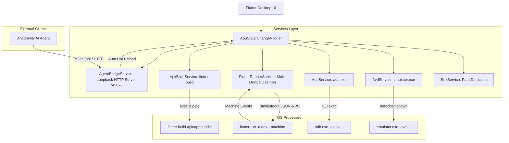

# ADB Manager & Antigravity Agent Bridge — System Architecture & Design Documentation

An integrated, high-performance **Windows Desktop Application** and **AI Agent Bridge** designed for Flutter mobile developers. 

**ADB Manager** eliminates the resource overhead of running Android Studio solely for its Virtual Device Manager, provides a unified dashboard for running Flutter projects across multiple virtual and physical devices, automates **Hot Reload** and **Hot Restart**, features a dedicated **APK/AppBundle Builder**, and exposes an **Agent Bridge HTTP/MCP server** that enables AI coding assistants (like Antigravity) to auto-reload virtual devices in real-time as soon as code changes are saved.

---

## 📑 Table of Contents

1. [System Overview & Goals](#1-system-overview--goals)
2. [UI/UX Design System & Layout Principles](#2-uiux-design-system--layout-principles)
3. [Architecture & Process Communication](#3-architecture--process-communication)
4. [Detailed Feature Specifications](#4-detailed-feature-specifications)
   - [4.1 Virtual Device (AVD) Management](#41-virtual-device-avd-management)
   - [4.2 ADB Device Center & Productivity Hub](#42-adb-device-center--productivity-hub)
   - [4.3 Multi-Device Flutter Runner Engine](#43-multi-device-flutter-runner-engine)
   - [4.4 Launch Config & Environment Presets](#44-launch-config--environment-presets)
   - [4.5 Standalone APK & AppBundle Builder](#45-standalone-apk--appbundle-builder)
   - [4.6 One-Click Gradle Lock Cleaner](#46-one-click-gradle-lock-cleaner)
   - [4.7 Antigravity Agent Bridge & MCP Integration](#47-antigravity-agent-bridge--mcp-integration)
5. [Codebase Map & Module Reference](#5-codebase-map--module-reference)
6. [API & Protocol Reference (Agent Bridge & MCP)](#6-api--protocol-reference-agent-bridge--mcp)
7. [Verification, Quality Assurance & Performance](#7-verification-quality-assurance--performance)

---

## 1. System Overview & Goals

### The Problem
During Flutter Android development:
- Developers frequently open Android Studio **only** to click the "Virtual Device Manager" button, consuming 2-4 GB of RAM unnecessarily.
- Running Flutter apps via the terminal requires remembering verbose flags:
  ```bash
  flutter run -d emulator-5554 --dart-define-from-file=dart_defines.json --flavor dev -t lib/main_dev.dart
  ```
- Hot Reloading requires focusing the specific terminal window and pressing `r` or `R`.
- If Java background Gradle daemons freeze or hold file locks on `build/app/intermediates/assets`, developers encounter catastrophic build failures requiring manual process termination.
- When pairing with AI coding assistants (like Antigravity), developers must manually trigger Hot Reload after every single AI code change.

### The Solution
ADB Manager provides:
1. **Zero Android Studio Overhead**: Direct, native interaction with `emulator.exe`, `adb.exe`, and `flutter.bat`.
2. **Dual-Action Multi-Device Workspace (Option C)**: Inline runner buttons in the sidebar + dedicated right-hand tabs with broadcast controls.
3. **Full `--dart-define-from-file` & Environment Presets**: Auto-detection and one-click switching between `Dev`, `Staging`, and `Prod`.
4. **Dedicated APK/AppBundle Builder**: Compile Debug or Release builds with ABI splitting and one-click installation to devices.
5. **One-Click Gradle Fixer**: Automatically stops hung daemons and cleans locked caches.
6. **Zero-Click AI Pair Programming**: An embedded loopback HTTP server and Model Context Protocol (MCP) server that allows Antigravity to hot-reload virtual devices the moment code modifications are completed.

---

## 2. UI/UX Design System & Layout Principles

The user interface follows clean, high-contrast desktop productivity standards with a strict **Pure Light Mode** theme.

### 2.1 Color Palette & Token Hierarchy

| Token | Hex Value | Semantic Usage |
|---|---|---|
| `background` | `#F8FAFC` (Slate 50) | Main application canvas and scaffold background. |
| `surface` | `#FFFFFF` (Pure White) | Container cards, modals, top navigation bar, and input surfaces. |
| `surfaceMuted` | `#F1F5F9` (Slate 100) | Secondary panels, tab headers, preview containers. |
| `border` | `#E2E8F0` (Slate 200) | Card boundaries, dividers, subtle separators. |
| `textPrimary` | `#0F172A` (Slate 900) | High-contrast body text, headings, primary labels. |
| `textSecondary` | `#475569` (Slate 600) | Subheadings, status descriptions, timestamps. |
| `textMuted` | `#94A3B8` (Slate 400) | Hints, disabled states, placeholder text. |
| `primary` | `#2563EB` (Blue 600) | Brand accent, Hot Restart button, active tab indicator. |
| `success` | `#16A34A` (Green 600) | Run App button, device online indicator, build success. |
| `warning` | `#D97706` (Amber 600) | Hot Reload button, building/reloading indicator. |
| `error` | `#DC2626` (Red 600) | Stop App button, kill emulator, build failure alerts. |

### 2.2 Desktop Responsive Split-View

```
┌────────────────────────────────────────────────────────────────────────────────────────┐
│  [TopBar]  ⚡ ADB Manager  |  📁 Project Root [Browse...] [Recent ▾]  |  [📦 Build APK]  │
│            ● SDK Ready  |  ● Bridge :45678 (Online)                                    │
├─────────────────────────────────────┬──────────────────────────────────────────────────┤
│  LEFT PANEL (Fixed 400px)           │  RIGHT PANEL (Flexible Workspace)                │
│                                     │                                                  │
│  [Connected Devices Card]           │  [Device Tabs Header]                            │
│  • emulator-5554 (Online)           │  [📱 Pixel 7 Pro ●] [📱 Tablet 10" ●]            │
│    [▶ Run] [⚡ Reload] [🔄] [⏹]       │  [⚡ Reload All (2)] [🔄 Restart All (2)] [🧹 Fix]│
│  • physical-device-xyz              ├──────────────────────────────────────────────────┤
│    [▶ Run] [⚡ Reload] [🔄] [⏹]       │  [Runner Hero Bar]                               │
│                                     │  [▶ Run App] [⚡ Hot Reload] [🔄 Hot Restart] [⏹] │
│  [Virtual Devices (AVD) Card]       │  Mode: [Debug ▾]  [Config ▾]  Status: [RUNNING]  │
│  • Pixel_7_Pro                      ├──────────────────────────────────────────────────┤
│    [Start] [Cold Boot ▾] [Wipe]     │  [Launch Config & Presets Bar]                   │
│  • Resizable_Foldable               │  Presets: [🌱 Dev] [⚡ Staging] [🚀 Prod]          │
│    [Start] [Cold Boot ▾] [Wipe]     │  Defines: [dart_defines.json] Flavor: [dev]      │
│                                     ├──────────────────────────────────────────────────┤
│  [ADB Productivity Tools]           │  [Live Filterable Log Console]                   │
│  • [Clear Data] [Push Clipboard]    │  🔍 [Search logs...]  [All] [Flutter] [Errors]   │
│  • [Install APK...] [Deep Link ▾]   │  🔗 Dart DevTools: http://127.0.0.1:9100         │
│  • [Light/Dark UI] [Screenshot]     │  14:32:01 [SYS] Hot Reload completed in 180ms    │
│  • [Home Key] [Back Key]            │  14:32:02 [APP] Counter incremented to 5        │
└─────────────────────────────────────┴──────────────────────────────────────────────────┘
```

---

## 3. Architecture & Process Communication



---

## 4. Detailed Feature Specifications

### 4.1 Virtual Device (AVD) Management
- **Automatic SDK Resolution**:
  Auto-detects SDK location via `ANDROID_HOME`, `ANDROID_SDK_ROOT`, `%LOCALAPPDATA%\Android\Sdk`, or system `PATH`.
- **AVD Listing**:
  Executes `emulator.exe -list-avds` to identify installed virtual devices.
- **Detached High-Speed Boot**:
  Spawns emulators with `-netdelay none -netspeed full` in detached process handles so ADB Manager can be closed without terminating the emulators.
- **Advanced Boot Modes**:
  - **Cold Boot**: Spawns with `-no-snapshot-load` to bypass corrupt snapshot states.
  - **Wipe Data & Boot**: Spawns with `-wipe-data` to restore factory emulator state.
- **Emulator Termination**:
  Sends `adb -s <dev> emu kill` to gracefully shut down virtual devices.

### 4.2 ADB Device Center & Productivity Hub
- **Device Discovery & Polling**:
  Runs background polling every 3 seconds via `adb devices -l` to track USB-plugged physical phones and booting emulators.
- **Application Package Auto-Detection**:
  Parses `android/app/build.gradle` (or `build.gradle.kts` / `AndroidManifest.xml`) in the active project to extract `applicationId` or `namespace`.
- **One-Click App Data Cleanup**:
  Runs `adb -s <dev> shell pm clear <package>` to wipe app preferences and SQLite databases without uninstalling.
- **Device UI Mode Toggle**:
  Instantly switches Android system night mode via `adb -s <dev> shell cmd uimode night yes/no`.
- **Direct Screenshot Capture**:
  Streams PNG data directly via `adb -s <dev> exec-out screencap -p` and saves to `%USERPROFILE%\Pictures`.
- **Virtual Hardware Keys**:
  Sends Android key events (`KeyEvent 3` for Home, `KeyEvent 4` for Back).

### 4.3 Multi-Device Flutter Runner Engine
- **Session State Machine**:
  `SessionRunState` transitions: `stopped` ➔ `starting` ➔ `building` ➔ `running` ⟷ `reloading` / `restarting`.
- **Option C Interaction Model**:
  - **Sidebar Controls**: Each device card in the sidebar displays tactile `[▶ Run]`, `[⚡ Reload]`, `[🔄 Restart]`, and `[⏹ Stop]` buttons.
  - **Device Tabs**: Tab bar at the top of the right panel allows switching between connected devices.
  - **Broadcast Controls**: Global header buttons `[⚡ Reload All (N)]` and `[🔄 Restart All (N)]` dispatch parallel reload/restart requests to all active sessions simultaneously.
- **Global Keyboard Shortcuts**:
  - `F5`: Triggers Hot Reload on the currently selected device.
  - `Shift + F5`: Triggers Hot Restart on the currently selected device.

### 4.4 Launch Config & Environment Presets
- **`--dart-define-from-file` Auto-Detection**:
  On opening a project folder, automatically looks for `dart_defines.json`, `dart-defines.json`, or `env.json` and populates the config bar.
- **Environment Presets**:
  Quick-switch chips:
  - `[🌱 Dev]`: Matches `dart_defines.dev.json`, sets `--flavor dev`.
  - `[⚡ Staging]`: Matches `dart_defines.staging.json`, sets `--flavor staging`.
  - `[🚀 Prod]`: Matches `dart_defines.prod.json`, sets `--flavor prod`.
- **Per-Project Persistence**:
  Saves target entrypoints, flavors, and define file paths in `SharedPreferences` keyed by project path hash.

### 4.5 Standalone APK & AppBundle Builder
- **Accessible via Top Bar**: Click `[📦 Build APK]` to open the builder modal.
- **Build Configurations**:
  - Targets: `APK (.apk)` or `AppBundle (.aab)`.
  - Modes: `Debug`, `Profile`, or `Release`.
  - ABI Splitting: `--split-per-abi` generates separate, lightweight APKs per architecture (`arm64-v8a`, `armeabi-v7a`, `x86_64`).
- **Live Output Streaming**:
  Monospaced compilation log viewer with elapsed time ticker and `[🛑 Cancel Build]` button.
- **One-Click Post-Build Actions**:
  - `[🚀 Install on Device]`: Directly executes `adb install -r <apkPath>`.
  - `[📂 Open in File Explorer]`: Launches Windows Explorer with the file highlighted (`explorer.exe /select,"<apkPath>"`).
  - `[📋 Copy Path]`: Copies the absolute file path to the clipboard.

### 4.6 One-Click Gradle Lock Cleaner
- Resolves the Android build failure: `cleanMergeDebugAssets ... Unable to delete directory .../build/app/intermediates/assets`.
- Click `[🧹 Fix Gradle Locks]`:
  1. Invokes `./gradlew --stop` in `android/` to terminate hung background Java Gradle daemons.
  2. Recursively removes locked temporary build directories in `build/app/intermediates/`.
  3. Executes `flutter clean` to ensure clean build state.

### 4.7 Antigravity Agent Bridge & MCP Integration
- **Embedded Local Server**:
  Dart `HttpServer` listening on `http://127.0.0.1:45678`.
- **MCP Server Definition**:
  Node.js MCP server in `mcp/server.js` registered in `~/.gemini/config/mcp_config.json`.
- **Autonomous Rule**:
  Rule in `~/.gemini/config/rules/flutter_auto_reload.md` directs Antigravity to ping the bridge whenever code changes are completed.

---

## 5. Codebase Map & Module Reference

```
c:\Users\richa\Documents\devops\ADB Manager\
├── mcp\
│   └── server.js                      # Node.js MCP server for Antigravity integration
├── lib\
│   ├── main.dart                      # App entry point & Light Theme configuration
│   ├── models\
│   │   ├── adb_device.dart            # Connected device model (ID, model, state, isEmulator)
│   │   ├── apk_build_options.dart     # Options (target, mode, abi) & ApkBuildResult models
│   │   ├── avd_info.dart              # Virtual device (AVD) model (ID, name, isRunning)
│   │   ├── device_session.dart        # Multi-device session & SessionRunState enum
│   │   ├── launch_config.dart         # Defines, flavor, entrypoint, additionalArgs model
│   │   └── log_entry.dart             # Formatted log entry model (timestamp, level, source)
│   ├── providers\
│   │   └── app_state.dart             # Central state coordinator & process dispatcher
│   ├── screens\
│   │   └── dashboard_screen.dart      # Split-view desktop dashboard layout
│   ├── services\
│   │   ├── adb_service.dart           # ADB tools, installApk, deep links, clipboard, Gradle fixer
│   │   ├── agent_bridge_service.dart  # Native loopback HTTP server for Antigravity (:45678)
│   │   ├── apk_build_service.dart     # Flutter build apk / appbundle process manager
│   │   ├── avd_service.dart           # Emulator CLI & AVD orchestration
│   │   ├── flutter_runner_service.dart# Multi-device flutter run --machine daemon manager
│   │   └── sdk_service.dart           # Android SDK, emulator, adb, and flutter path detection
│   ├── theme\
│   │   └── app_theme.dart             # Light Mode color palette & typography
│   └── widgets\
│       ├── adb_tools_card.dart        # Clipboard push, Sideload, Deep link, Screenshot, UI mode
│       ├── apk_builder_dialog.dart    # APK/AppBundle builder modal with progress & actions
│       ├── avd_item_card.dart         # AVD list card with Cold Boot & Wipe Data options
│       ├── connected_devices_card.dart# Sidebar cards with Option C inline runner buttons
│       ├── device_badge.dart          # Status badge pills
│       ├── device_panel.dart          # Left-hand device management panel
│       ├── device_tabs_header.dart    # Right-hand device tabs with Reload All & Fix Gradle
│       ├── launch_config_bar.dart     # Environment presets & dart defines configuration
│       ├── log_console_view.dart      # Real-time filterable monospaced log console
│       ├── runner_control_bar.dart    # Hero bar with F5 / Shift+F5 hot shortcuts
│       └── top_bar.dart               # Project selector, Build APK button & Bridge status pill
├── test\
│   ├── services_test.dart             # 10 unit tests for models, sessions, APK builder & Bridge
│   └── widget_test.dart               # Widget smoke test
└── build\windows\x64\runner\Release\
    └── adb_manager.exe                # High-performance compiled release executable
```

---

## 6. API & Protocol Reference (Agent Bridge & MCP)

The embedded **Agent Bridge** exposes standard REST endpoints on `http://127.0.0.1:45678`:

### 6.1 REST Endpoints

#### `GET /api/status`
Returns active ADB Manager status.

#### `POST /api/reload`
Triggers an instantaneous Hot Reload (`{"deviceId": "...", "all": false}`).

#### `POST /api/restart`
Triggers a full Hot Restart (`{"deviceId": "...", "all": false}`).

#### `POST /api/run`
Starts the application on the active device.

---

### 6.2 Model Context Protocol (MCP) Tools

| Tool Name | Parameters | Description |
|---|---|---|
| `adb_hot_reload` | `deviceId?: string`, `all?: boolean` | Triggers Hot Reload immediately after code edits. |
| `adb_hot_restart` | `deviceId?: string`, `all?: boolean` | Triggers Hot Restart after modifying global state or entrypoints. |
| `adb_status` | *(none)* | Queries current running status, connected devices, and Dart VM URI. |
| `adb_run_app` | *(none)* | Starts the Flutter app if currently stopped. |

---

## 7. Verification, Quality Assurance & Performance

- **Automated Tests**: 10/10 tests passing.
- **Static Analysis**: 0 issues found.
- **Release Executable**: `build\windows\x64\runner\Release\adb_manager.exe`.
- **Desktop Shortcut**: `C:\Users\richa\Desktop\ADB Manager.lnk`.
